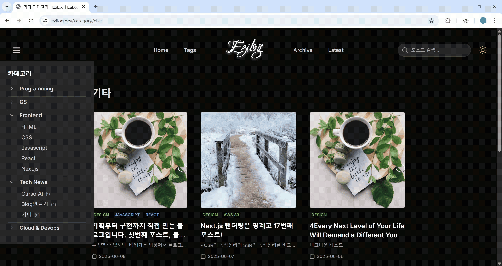
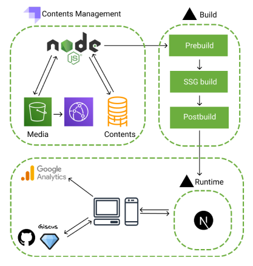

# 📝 ezilog

> 전통적인 CMS 플랫폼의 디자인·도메인 제약으로부터 자유로운 헤드리스 블로그. 
> 제로 코스트로 운영하면서도 사용자 경험은 타협하지 않습니다.

**[🌐 ezilog.dev 방문하기](https://ezilog.dev)**

 

## ✨ 블로그 설명

### 🌓 라이트·다크모드 & 반응형 디자인

> 다크모드, 반응형 레이아웃, 타이포그래피 구현!

### 🔍 빠르고 가벼운 포스트 검색

> 빌드 타임에 생성된 정적 JSON을 기반으로 **'테그','카테고리','제목'** 3가지 분류에 대한 클라이언트 사이드 전문 검색을 제공!

 

## 🏗 아키텍처

**Next.js 15 (SSG) + Strapi v5 + Supabase PostgreSQL + AWS S3 / CloudFront + Vercel**

`💡 모든 페이지는 빌드 타임에 사전 생성됩니다. 런타임 API 호출 없이 독자에게는 순수한 정적 HTML만 전달됩니다!`

 

## 🛠 기술 스택

| 레이어 | 적용 기술 |
| :--- | :--- |
| **🖥 프론트엔드** | Next.js 15, React 19, TailwindCSS, next-themes |
| **🗄 CMS** | Strapi v5 (Render) |
| **🗃 데이터베이스** | Supabase PostgreSQL |
| **☁️ 미디어/CDN** | AWS S3 + CloudFront CDN |
| **🚀 배포** | Vercel (SSG + Edge CDN) |
| **💬 댓글** | Giscus (GitHub Discussions) |

 

## ⚙️ 동작 방식

1. **Trigger:** `git push` → Vercel 빌드 트리거
2. **Prebuild:** 스크립트가 Strapi에서 전체 콘텐츠를 가져와 정적 JSON으로 직렬화
3. **SSG:** Next.js가 해당 JSON을 기반으로 모든 페이지를 정적 생성
4. **Postbuild:** `sitemap.xml` 자동 생성 (SEO 최적화)
5. **Serve:** 독자는 순수 정적 HTML을 받음 (Strapi는 요청 경로에 관여하지 않음)

 

## 📦 오픈소스 기여 (NPM Package)

초기 개발 과정에서 기존 Strapi Marketplace Provider의 Node 및 Strapi v5 호환성 문제를 해결하기 위해 **Supabase Storage Provider를 TypeScript 기반으로 재설계하고 npm에 배포**했습니다.

🔗 **[strapi-provider-upload-supabase-bucket 살펴보기](https://market.strapi.io/providers/strapi-provider-upload-supabase-bucket)**